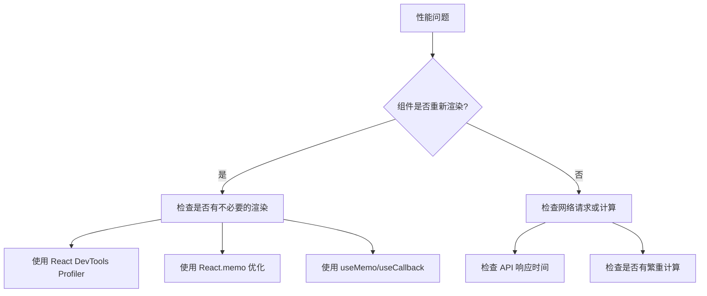

# React 调试技巧与常见问题

在 React 开发中，遇到问题是常态。掌握有效的调试技巧和了解常见问题的解决方案，能让你事半功倍。本篇将系统介绍 React 调试工具的使用方法，以及开发中最常遇到的问题及其解决方案。

## React DevTools 使用

### 组件树检查

React DevTools 提供了强大的组件树检查功能：

1. **Components 面板** - 查看组件层次结构
2. **Profiler 面板** - 分析渲染性能
3. **搜索功能** - 快速定位组件
4. **过滤器** - 按名称、来源等过滤组件

### Props 与 State 检查

```tsx
// 在组件中添加调试信息
function UserCard({ user }: { user: User }) {
  // 开发环境下添加调试日志
  if (process.env.NODE_ENV === 'development') {
    console.log('UserCard props:', { user });
  }

  return (
    <div className="user-card">
      <h3>{user.name}</h3>
      <p>{user.email}</p>
    </div>
  );
}

// 使用 React DevTools Hook
import { useDebugValue } from 'react';

function useOnlineStatus() {
  const [isOnline, setIsOnline] = useState(navigator.onLine);

  // 添加调试标签
  useDebugValue(isOnline ? '在线' : '离线');

  useEffect(() => {
    const handleOnline = () => setIsOnline(true);
    const handleOffline = () => setIsOnline(false);

    window.addEventListener('online', handleOnline);
    window.addEventListener('offline', handleOffline);

    return () => {
      window.removeEventListener('online', handleOnline);
      window.removeEventListener('offline', handleOffline);
    };
  }, []);

  return isOnline;
}
```

### Profiler 性能分析

1. **记录渲染** - 启用 Profiler 记录组件渲染
2. **火焰图** - 查看每次渲染的耗时
3. **排名图** - 按渲染次数排序组件
4. **搜索** - 查找特定组件的渲染情况

```tsx
// 编程式使用 Profiler
import { Profiler } from 'react';

function onRenderCallback(
  id: string,
  phase: 'mount' | 'update',
  actualDuration: number,
  baseDuration: number,
  startTime: number,
  commitTime: number,
  interactions: Set<string>
) {
  console.log(`Profiler [${id}] ${phase}:`, {
    actualDuration,
    baseDuration,
    startTime,
    commitTime,
  });
}

function App() {
  return (
    <Profiler id="App" onRender={onRenderCallback}>
      <Dashboard />
    </Profiler>
  );
}
```

## 常见问题及解决方案

### 组件不渲染

| 问题原因 | 症状 | 解决方案 |
|---------|------|---------|
| 条件渲染错误 | 组件消失 | 检查条件逻辑，确保返回 JSX |
| 返回值错误 | 空白或错误 | 确保返回有效的 JSX 元素 |
| 导入错误 | 组件未定义 | 检查导入路径和组件名称 |
| Props 错误 | 渲染异常 | 检查 Props 类型和默认值 |

```tsx
// 问题：条件渲染导致组件消失
function UserProfile({ user }: { user: User | null }) {
  // 错误：user 为 null 时返回 false，不会渲染
  // return user && <div>{user.name}</div>;

  // 正确：使用三元运算符或可选链
  return user ? <div>{user.name}</div> : <div>未登录</div>;
}

// 问题：忘记返回 JSX
function Counter() {
  const [count, setCount] = useState(0);

  // 错误：没有返回值
  // if (count < 0) {
  //   setCount(0);
  // }

  // 正确：使用 useEffect 处理副作用
  useEffect(() => {
    if (count < 0) {
      setCount(0);
    }
  }, [count]);

  return (
    <div>
      <p>Count: {count}</p>
      <button onClick={() => setCount(count + 1)}>Increment</button>
    </div>
  );
}
```

### 无限重渲染

| 问题原因 | 症状 | 解决方案 |
|---------|------|---------|
| 依赖数组错误 | 页面卡死 | 正确设置 useEffect 依赖 |
| 直接修改 State | 持续渲染 | 使用不可变更新 |
| 创建新对象 | 重复渲染 | 使用 useMemo 或 useCallback |
| Context 值变化 | 子组件重渲染 | 拆分 Context 或使用 memo |

```tsx
// 问题：useEffect 依赖导致无限循环
function SearchComponent({ query }: { query: string }) {
  const [results, setResults] = useState<string[]>([]);

  // 错误：每次渲染都创建新函数，导致无限循环
  // useEffect(() => {
  //   fetchResults(query).then(setResults);
  // }, [fetchResults]);  // fetchResults 每次都是新函数

  // 正确：使用 useCallback 或内联函数
  useEffect(() => {
    const fetchResults = async () => {
      const response = await fetch(`/api/search?q=${query}`);
      const data = await response.json();
      setResults(data);
    };

    fetchResults();
  }, [query]);  // 只在 query 变化时执行

  return (
    <ul>
      {results.map((result, index) => (
        <li key={index}>{result}</li>
      ))}
    </ul>
  );
}

// 问题：直接修改 State
function TodoList() {
  const [todos, setTodos] = useState<Todo[]>([]);

  const addTodo = (text: string) => {
    // 错误：直接修改数组
    // todos.push({ id: Date.now(), text, completed: false });

    // 正确：创建新数组
    setTodos([
      ...todos,
      { id: Date.now(), text, completed: false },
    ]);
  };

  const toggleTodo = (id: number) => {
    // 错误：直接修改对象
    // todos.find(t => t.id === id).completed = !todos.find(t => t.id === id).completed;

    // 正确：创建新数组和对象
    setTodos(
      todos.map((todo) =>
        todo.id === id
          ? { ...todo, completed: !todo.completed }
          : todo
      )
    );
  };

  return (
    <div>
      <button onClick={() => addTodo('New Todo')}>Add Todo</button>
      <ul>
        {todos.map((todo) => (
          <li
            key={todo.id}
            onClick={() => toggleTodo(todo.id)}
            style={{
              textDecoration: todo.completed ? 'line-through' : 'none',
            }}
          >
            {todo.text}
          </li>
        ))}
      </ul>
    </div>
  );
}
```

### State 异步更新

```tsx
// 问题：State 更新后立即读取
function Counter() {
  const [count, setCount] = useState(0);

  const handleIncrement = () => {
    setCount(count + 1);
    console.log(count);  // 仍然显示旧值！
  };

  // 正确：使用 useEffect 监听变化
  useEffect(() => {
    console.log('Count changed to:', count);
  }, [count]);

  // 或者使用函数式更新获取最新值
  const handleIncrementAndLog = () => {
    setCount((prevCount) => {
      const newCount = prevCount + 1;
      console.log('New count:', newCount);  // 正确的新值
      return newCount;
    });
  };

  return (
    <div>
      <p>Count: {count}</p>
      <button onClick={handleIncrement}>Increment</button>
    </div>
  );
}
```

### 闭包陷阱

```tsx
// 问题：闭包捕获过期的值
function Timer() {
  const [count, setCount] = useState(0);

  const handleStart = () => {
    // 错误：闭包捕获了初始的 count
    // setInterval(() => {
    //   console.log('Current count:', count);  // 永远是 0
    //   setCount(count + 1);  // 永远设置为 1
    // }, 1000);

    // 正确：使用函数式更新
    const intervalId = setInterval(() => {
      setCount((prevCount) => prevCount + 1);
    }, 1000);

    // 保存 intervalId 以便清理
    return () => clearInterval(intervalId);
  };

  return (
    <div>
      <p>Count: {count}</p>
      <button onClick={handleStart}>Start</button>
    </div>
  );
}

// 问题：事件处理器中的闭包
function SearchInput() {
  const [query, setQuery] = useState('');
  const [results, setResults] = useState<string[]>([]);

  const handleSearch = useCallback(async () => {
    // 正确：使用 ref 获取最新值
    const response = await fetch(`/api/search?q=${query}`);
    const data = await response.json();
    setResults(data);
  }, [query]);

  return (
    <div>
      <input
        value={query}
        onChange={(e) => setQuery(e.target.value)}
        placeholder="Search..."
      />
      <button onClick={handleSearch}>Search</button>
      <ul>
        {results.map((result, index) => (
          <li key={index}>{result}</li>
        ))}
      </ul>
    </div>
  );
}
```

## Hooks 常见错误

### 规则违反

```tsx
// ❌ 错误：在条件语句中使用 Hook
function Component({ shouldRender }: { shouldRender: boolean }) {
  if (shouldRender) {
    const [data, setData] = useState(null);  // 违反 Hook 规则
  }
  return <div>Content</div>;
}

// ✅ 正确：Hook 必须在顶层调用
function Component({ shouldRender }: { shouldRender: boolean }) {
  const [data, setData] = useState(null);

  if (!shouldRender) {
    return null;
  }

  return <div>{data}</div>;
}

// ❌ 错误：在循环中使用 Hook
function List({ items }: { items: string[] }) {
  return (
    <ul>
      {items.map((item, index) => {
        const [isSelected, setIsSelected] = useState(false);  // 违反规则
        return (
          <li
            key={index}
            onClick={() => setIsSelected(!isSelected)}
            style={{ fontWeight: isSelected ? 'bold' : 'normal' }}
          >
            {item}
          </li>
        );
      })}
    </ul>
  );
}

// ✅ 正确：提取为独立组件
function ListItem({ item }: { item: string }) {
  const [isSelected, setIsSelected] = useState(false);

  return (
    <li
      onClick={() => setIsSelected(!isSelected)}
      style={{ fontWeight: isSelected ? 'bold' : 'normal' }}
    >
      {item}
    </li>
  );
}

function List({ items }: { items: string[] }) {
  return (
    <ul>
      {items.map((item, index) => (
        <ListItem key={index} item={item} />
      ))}
    </ul>
  );
}
```

### 依赖数组遗漏

```tsx
// 问题：遗漏依赖
function UserProfile({ userId }: { userId: number }) {
  const [user, setUser] = useState<User | null>(null);

  // ❌ 错误：遗漏了 userId 依赖
  // useEffect(() => {
  //   fetchUser(userId).then(setUser);
  // }, []);  // 只在组件挂载时执行

  // ✅ 正确：包含所有依赖
  useEffect(() => {
    fetchUser(userId).then(setUser);
  }, [userId]);

  return user ? <div>{user.name}</div> : <div>Loading...</div>;
}

// 使用 eslint-plugin-react-hooks 检测
// .eslintrc.js
module.exports = {
  plugins: ['react-hooks'],
  rules: {
    'react-hooks/rules-of-hooks': 'error',
    'react-hooks/exhaustive-deps': 'warn',
  },
};
```

### 内存泄漏

```tsx
// 问题：未清理副作用
function DataFetcher({ url }: { url: string }) {
  const [data, setData] = useState(null);

  // ❌ 错误：没有清理函数
  // useEffect(() => {
  //   fetch(url).then(res => res.json()).then(setData);
  // }, [url]);

  // ✅ 正确：使用 AbortController 清理
  useEffect(() => {
    const controller = new AbortController();

    const fetchData = async () => {
      try {
        const response = await fetch(url, {
          signal: controller.signal,
        });
        const result = await response.json();
        setData(result);
      } catch (error) {
        if (error instanceof DOMException && error.name === 'AbortError') {
          // 请求被取消，忽略错误
        } else {
          console.error('Fetch error:', error);
        }
      }
    };

    fetchData();

    return () => controller.abort();
  }, [url]);

  return data ? <div>{JSON.stringify(data)}</div> : <div>Loading...</div>;
}

// 问题：事件监听器未清理
function WindowSize() {
  const [size, setSize] = useState({
    width: window.innerWidth,
    height: window.innerHeight,
  });

  // ❌ 错误：没有清理事件监听器
  // useEffect(() => {
  //   const handleResize = () => {
  //     setSize({
  //       width: window.innerWidth,
  //       height: window.innerHeight,
  //     });
  //   };
  //   window.addEventListener('resize', handleResize);
  // }, []);

  // ✅ 正确：清理事件监听器
  useEffect(() => {
    const handleResize = () => {
      setSize({
        width: window.innerWidth,
        height: window.innerHeight,
      });
    };

    window.addEventListener('resize', handleResize);

    return () => window.removeEventListener('resize', handleResize);
  }, []);

  return (
    <div>
      <p>Width: {size.width}</p>
      <p>Height: {size.height}</p>
    </div>
  );
}
```

## 性能问题排查流程

### 排查步骤



### 性能优化检查清单

| 类别 | 检查项 | 工具/方法 |
|------|--------|----------|
| 组件渲染 | 不必要的重渲染 | React DevTools Profiler |
| 组件渲染 | 组件是否 memo | React.memo |
| 计算 | 昂贵计算是否缓存 | useMemo |
| 事件处理 | 回调函数是否稳定 | useCallback |
| 列表渲染 | key 是否合适 | 检查列表 key |
| 代码分割 | 是否使用懒加载 | React.lazy + Suspense |
| 图片 | 是否优化图片 | 压缩、懒加载 |
| 网络 | 是否减少请求 | 合并请求、缓存 |

## StrictMode 的作用

```tsx
// StrictMode 会在开发模式下启用额外检查
import { StrictMode } from 'react';
import { createRoot } from 'react-dom/client';

function App() {
  return (
    <StrictMode>
      <MainApp />
    </StrictMode>
  );
}

// StrictMode 会：
// 1. 检查意外的副作用
// 2. 检测过时的 API
// 3. 检测遗留的 context API
// 4. 检测不兼容的 future API
// 5. 帮助确保组件可复用
// 6. 在开发模式下渲染组件两次（检测副作用）
```

## 错误边界实现

```tsx
import React, { Component, ErrorInfo, ReactNode } from 'react';

interface Props {
  children: ReactNode;
  fallback?: ReactNode;
}

interface State {
  hasError: boolean;
  error?: Error;
}

class ErrorBoundary extends Component<Props, State> {
  constructor(props: Props) {
    super(props);
    this.state = { hasError: false };
  }

  static getDerivedStateFromError(error: Error): State {
    return { hasError: true, error };
  }

  componentDidCatch(error: Error, errorInfo: ErrorInfo) {
    console.error('Error caught by boundary:', error);
    console.error('Component stack:', errorInfo.componentStack);
  }

  render() {
    if (this.state.hasError) {
      return this.props.fallback || (
        <div className="error-boundary">
          <h2>出错了</h2>
          <p>{this.state.error?.message}</p>
          <button onClick={() => this.setState({ hasError: false })}>
            重试
          </button>
        </div>
      );
    }

    return this.props.children;
  }
}

// 使用错误边界
function App() {
  return (
    <ErrorBoundary fallback={<div>应用出错了，请刷新页面</div>}>
      <Header />
      <MainContent />
      <Footer />
    </ErrorBoundary>
  );
}
```

## ESLint 配置

```json
// .eslintrc.json
{
  "extends": [
    "eslint:recommended",
    "plugin:react/recommended",
    "plugin:react-hooks/recommended"
  ],
  "plugins": ["react", "react-hooks"],
  "rules": {
    "react-hooks/rules-of-hooks": "error",
    "react-hooks/exhaustive-deps": "warn",
    "react/prop-types": "off",
    "react/react-in-jsx-scope": "off"
  },
  "settings": {
    "react": {
      "version": "detect"
    }
  }
}
```

## 实战：排查和修复闭包陷阱

```tsx
// 问题代码：搜索框防抖
function SearchBox() {
  const [query, setQuery] = useState('');
  const [results, setResults] = useState<string[]>([]);

  const search = useCallback(async (searchQuery: string) => {
    const response = await fetch(`/api/search?q=${searchQuery}`);
    const data = await response.json();
    setResults(data);
  }, []);  // ❌ 问题：空依赖数组

  useEffect(() => {
    const timer = setTimeout(() => {
      search(query);  // ❌ 问题：闭包捕获了旧的 query
    }, 500);

    return () => clearTimeout(timer);
  }, [query, search]);

  return (
    <div>
      <input
        value={query}
        onChange={(e) => setQuery(e.target.value)}
        placeholder="Search..."
      />
      <ul>
        {results.map((result, index) => (
          <li key={index}>{result}</li>
        ))}
      </ul>
    </div>
  );
}

// 修复方案：使用 ref 存储最新值
function SearchBoxFixed() {
  const [query, setQuery] = useState('');
  const [results, setResults] = useState<string[]>([]);
  const queryRef = useRef(query);

  // 保持 ref 与 state 同步
  useEffect(() => {
    queryRef.current = query;
  }, [query]);

  const search = useCallback(async () => {
    const response = await fetch(`/api/search?q=${queryRef.current}`);
    const data = await response.json();
    setResults(data);
  }, []);  // ✅ 空依赖是安全的，因为使用 ref

  useEffect(() => {
    const timer = setTimeout(() => {
      search();  // ✅ 调用时不传参数，内部使用 ref
    }, 500);

    return () => clearTimeout(timer);
  }, [query, search]);

  return (
    <div>
      <input
        value={query}
        onChange={(e) => setQuery(e.target.value)}
        placeholder="Search..."
      />
      <ul>
        {results.map((result, index) => (
          <li key={index}>{result}</li>
        ))}
      </ul>
    </div>
  );
}

// 或者使用函数式更新避免闭包问题
function SearchBoxAlternative() {
  const [query, setQuery] = useState('');
  const [results, setResults] = useState<string[]>([]);

  useEffect(() => {
    const timer = setTimeout(async () => {
      if (query) {
        const response = await fetch(`/api/search?q=${query}`);
        const data = await response.json();
        setResults(data);
      }
    }, 500);

    return () => clearTimeout(timer);
  }, [query]);  // ✅ query 是基本类型，没有闭包问题

  return (
    <div>
      <input
        value={query}
        onChange={(e) => setQuery(e.target.value)}
        placeholder="Search..."
      />
      <ul>
        {results.map((result, index) => (
          <li key={index}>{result}</li>
        ))}
      </ul>
    </div>
  );
}
```

## 调试技巧总结

1. **使用 console.log** - 简单但有效，注意在生产环境移除
2. **React DevTools** - 组件树检查和性能分析
3. **Profiler** - 分析渲染性能
4. **错误边界** - 捕获和处理渲染错误
5. **ESLint** - 静态代码分析，提前发现问题
6. **TypeScript** - 类型检查，减少运行时错误
7. **单元测试** - 验证组件行为
8. **网络面板** - 检查 API 请求
9. **性能面板** - 分析内存和 CPU 使用
10. **React.StrictMode** - 开发模式下的额外检查

掌握这些调试技巧，将帮助你快速定位和解决 React 开发中的各种问题。