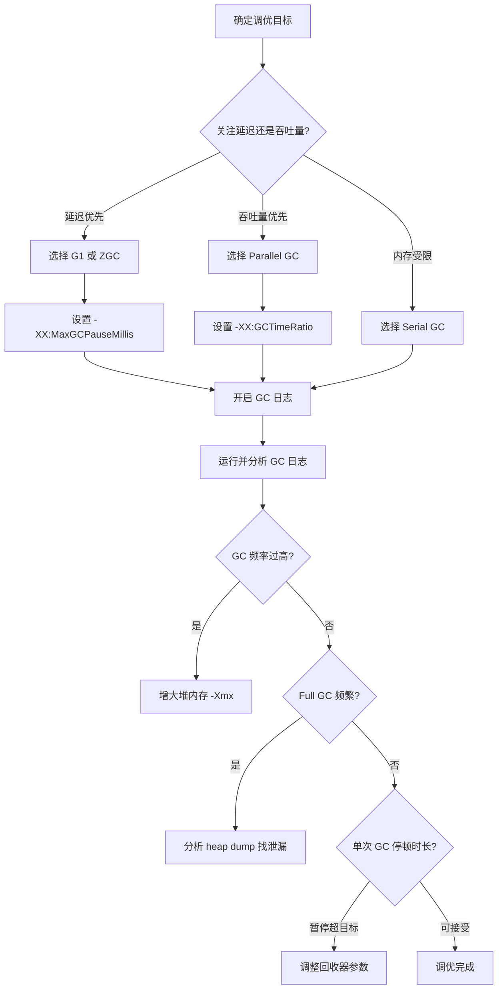

# JVM 内存模型与 GC 调优

> 适用版本：JDK 8 / JDK 11 / JDK 17+ | 参考规范：JVM Specification SE 8/11/17

***

## 一、JVM 内存区域

JVM 在运行时将内存划分为若干区域，每个区域承担不同的职责，生命周期也各不相同。

### 1.1 堆（Heap）

堆是 JVM 管理中最大的一块内存区域，**所有线程共享**，在 JVM 启动时创建，用于存放对象实例。

堆在物理上分为**年轻代（Young Generation）**和**老年代（Old Generation）**，在逻辑上又细分为：

| 分区 | 比例（默认） | 作用 |
|------|-------------|------|
| Eden | 年轻代的 80% | 新创建的对象首先分配在这里 |
| Survivor0 (S0) | 年轻代的 10% | 存放从 Eden 或 S1 晋升的存活对象 |
| Survivor1 (S1) | 年轻代的 10% | 与 S0 角色互换，保证始终有一个为空 |
| Old Generation | 堆的 2/3（默认） | 存放长期存活的大对象 |

> 默认 `-XX:NewRatio=2` 表示老年代:年轻代 = 2:1，`-XX:SurvivorRatio=8` 表示 Eden:S0:S1 = 8:1:1。

```java
// 演示对象在堆中的分配
public class HeapAllocationDemo {
    private static final int _1MB = 1024 * 1024;

    public static void main(String[] args) {
        byte[] allocation1 = new byte[2 * _1MB];  // 进入 Eden
        byte[] allocation2 = new byte[2 * _1MB];  // 进入 Eden
        byte[] allocation3 = new byte[2 * _1MB];  // 进入 Eden
        byte[] allocation4 = new byte[4 * _1MB];  // 触发 Minor GC，部分对象进入 Survivor 或老年代

        System.out.println("分配完成");
    }
}
```

```bash
# 启动参数：观察对象分配过程
-XX:+PrintGCDetails -Xms20M -Xmx20M -Xmn10M -XX:SurvivorRatio=8
```

***

### 1.2 元空间（Metaspace）

**JDK 8 开始用元空间取代永久代（PermGen）**，存放类的元数据（Class Metadata）、方法字节码、常量池等。

| 特性 | 永久代（JDK ≤7） | 元空间（JDK 8+） |
|------|------------------|------------------|
| 存储位置 | JVM 堆内 | 本地内存（Native Memory） |
| 默认大小 | 约 82MB（受 -XX:MaxPermSize 限制） | 无上限（受物理内存限制） |
| 溢出风险 | OOM: PermGen space | OOM: Metaspace |
| 调优参数 | -XX:PermSize / -XX:MaxPermSize | -XX:MetaspaceSize / -XX:MaxMetaspaceSize |

```java
// 模拟元空间溢出（加载大量类）
public class MetaspaceOOMDemo {
    public static void main(String[] args) throws Exception {
        // 使用 Spring ASM 或 CGLIB 动态生成类
        while (true) {
            // 每次循环生成一个新的 Class 并加载到元空间
            ClassLoader loader = new ClassLoader() {};
            Class<?> clazz = loader.loadClass("java.lang.Object");
            // 实际应使用 Enhancer / ASM 不断生成新类
        }
    }
}
```

```bash
# 元空间参数示例
-XX:MetaspaceSize=256m -XX:MaxMetaspaceSize=512m
```

***

### 1.3 虚拟机栈（VM Stack）

**线程私有**，每个 Java 方法被调用时创建一个**栈帧（Stack Frame）**，方法执行完毕则栈帧出栈。

```java
public class StackFrameDemo {
    public static void main(String[] args) {
        methodA(1, 2);
    }

    private static int methodA(int a, int b) {
        int result = methodB(a, b);
        return result + 1;
    }

    private static int methodB(int x, int y) {
        int sum = x + y;
        return sum;
    }
}
```

**栈帧包含四个部分：**

| 组成部分 | 说明 | 示例 |
|----------|------|------|
| 局部变量表 | 存储方法参数和局部变量（基本类型 + 对象引用） | `int a`、`Object ref` |
| 操作数栈 | 执行指令时的临时数据存储区，后进先出 | `iload_1`、`iadd` 操作在此完成 |
| 动态链接 | 指向运行时常量池中该方法的符号引用 | `invokevirtual #2 // Method methodB:(II)I` |
| 返回地址 | 方法退出后回到调用位置 | `return` 或异常表定位 |

```bash
# 查看字节码中的栈帧信息
javap -v StackFrameDemo.class

# 输出包含：
#   LocalVariableTable
#   StackMapTable
#   LineNumberTable
```

```bash
# 设置栈大小（默认 1024KB，Linux x64）
-Xss256k    # 缩小栈空间，允许更多线程
-Xss2m      # 增大栈空间，支持更深递归
```

```java
// 演示栈溢出
public class StackOverflowDemo {
    private static int depth = 0;

    public static void main(String[] args) {
        try {
            recursive();
        } catch (StackOverflowError e) {
            System.out.println("递归深度: " + depth);
        }
    }

    private static void recursive() {
        depth++;
        recursive();
    }
}
```

***

### 1.4 本地方法栈（Native Method Stack）

与虚拟机栈类似，但**为 Native 方法服务**。HotSpot 将虚拟机栈和本地方法栈合二为一。

```java
// 一个典型的 native 方法调用
public class NativeMethodDemo {
    // Object 中的 native 方法
    public static void main(String[] args) {
        // hashCode() 是 native 方法
        int hash = new Object().hashCode();
        // clone() 也是 native 方法
        Object clone = new Object().getClass().newInstance();

        System.out.println("hash: " + hash);
    }
}
```

***

### 1.5 程序计数器（Program Counter Register）

**线程私有**，记录当前线程执行的字节码指令地址。每个线程都有自己的 PC，互不影响。

* 如果执行的是 Java 方法，PC 记录正在执行的虚拟机字节码指令地址
* 如果执行的是 Native 方法，PC 为空（Undefined）
* **此区域是唯一不会出现 OOM 的内存区域**

```java
// 程序计数器无需人工操作，由 JVM 自动维护
// 以下代码在字节码层面可以看到明显的 PC 变化
public class PCDemo {
    public static void main(String[] args) {
        int a = 1;      // 0: iconst_1
        int b = 2;      // 1: istore_1
        int c = a + b;  // 2: iconst_2 → 3: istore_2 → 4: iload_1 → 5: iload_2 → 6: iadd → 7: istore_3
        System.out.println(c); // 8: getstatic ... → 11: iload_3 → 12: invokevirtual
    }
}
```

***

### 1.6 直接内存（Direct Memory）

**不属于 JVM 运行时数据区**，而是通过 NIO 的 `DirectByteBuffer` 在堆外分配的内存。使用 `Unsafe.allocateMemory()` 也可分配，但更推荐 NIO 方式。

```java
import java.nio.ByteBuffer;

public class DirectMemoryDemo {
    private static final int _100MB = 1024 * 1024 * 100;

    public static void main(String[] args) {
        // 分配 100MB 直接内存（堆外）
        ByteBuffer buffer = ByteBuffer.allocateDirect(_100MB);
        buffer.putInt(0, 42);
        System.out.println("读取: " + buffer.getInt(0));

        // 释放直接内存（建议手动调用，尽管 GC 会处理）
        // ((sun.nio.ch.DirectBuffer) buffer).cleaner().clean();
    }
}
```

```bash
# 设置最大直接内存（默认等于 -Xmx）
-XX:MaxDirectMemorySize=1g
```

**直接内存的优势**：减少数据从用户态到内核态的拷贝次数，适用于网络 IO 和文件 IO 密集型场景。

***

## 二、对象创建与内存分配

### 2.1 new 对象的完整流程

```java
public class ObjectCreationDemo {
    public static void main(String[] args) {
        // 这一行代码背后涉及多个步骤
        User user = new User("Alice", 25);
    }
}

class User {
    private String name;
    private int age;

    public User(String name, int age) {
        this.name = name;
        this.age = age;
    }
}
```

**JVM 执行 `new User(...)` 时的步骤：**

| 步骤 | 说明 | 对应字节码 |
|------|------|------------|
| ① 类加载检查 | 检查 `User` 类是否已被加载、解析、初始化。若未加载，先执行类加载流程 | — |
| ② 分配内存 | 从堆中划分一块固定大小的内存给新对象 | `new` 指令 |
| ③ 内存空间初始化（零值） | 将分配到的内存空间全部置为 0（不含对象头） | — |
| ④ 设置对象头 | 设置 Mark Word、元数据指针（类指针）、数组长度（如果是数组） | — |
| ⑤ 执行 `<init>` 方法 | 执行构造函数，即字节码中的 `invokespecial <init>` | `invokespecial <init>` |

```bash
# 查看字节码验证
javap -c -p -v ObjectCreationDemo.class

# 输出关键部分：
#  0: new           #7     → 类加载+内存分配
#  3: dup                 → 复制引用（用于 invokespecial 后的赋值）
#  4: ldc           #9     → 加载常量 "Alice"
#  6: bipush        25
#  8: invokespecial #10    → 调用 <init>
# 11: astore_1            → 赋值给局部变量
```

***

### 2.2 指针碰撞 vs 空闲列表

两种内存分配方式的选择取决于**堆是否规整**：

| 分配策略 | 适用场景 | 原理 | 关联 GC |
|----------|----------|------|---------|
| **指针碰撞（Bump The Pointer）** | 堆内存规整（无碎片） | 用一个指针标记空闲内存起点，分配时将指针向后移动对象大小 | Serial、ParNew 等带压缩整理的收集器 |
| **空闲列表（Free List）** | 堆内存不规整（有碎片） | JVM 维护一个空闲内存块列表，分配时找到足够大的块 | CMS 等基于 Mark-Sweep 的收集器 |

```java
// 指针碰撞示意（非真实代码，仅用于理解原理）
public class BumpPointerDemo {
    private long heapStart;  // 堆起始地址
    private long top;        // 当前分配指针（指向空闲内存起点）
    private long heapEnd;    // 堆结束地址

    public Object allocate(int size) {
        if (top + size > heapEnd) {
            throw new OutOfMemoryError("Heap exhausted");
        }
        // 指针碰撞：直接将 top 指针后移
        long address = top;
        top += size;
        return addressToObject(address);
    }

    private Object addressToObject(long address) {
        // 将地址转为对象引用（底层实现细节）
        return null;
    }
}
```

***

### 2.3 TLAB（Thread Local Allocation Buffer）

为了避免多线程并发分配内存时的锁竞争，JVM 为每个线程在 Eden 区分配一块**线程私有的缓冲区**。

```java
public class TLABDemo {
    public static void main(String[] args) {
        // 默认启用 TLAB，每个线程有独立的 Eden 子区域
        // 小对象优先在 TLAB 中分配
        byte[] buffer = new byte[1024];  // 1KB，可直接在 TLAB 中分配

        System.out.println("对象分配完成");
    }
}
```

```bash
# TLAB 相关参数
-XX:+UseTLAB                  # 启用 TLAB（JDK 8 默认开启）
-XX:TLABSize=512k             # 指定 TLAB 大小
-XX:TLABRefillWasteFraction=4 # TLAB 空间浪费阈值（默认 64，即 1/64）
-XX:-ResizeTLAB               # 禁止自动调整 TLAB 大小
-XX:+PrintTLAB                # 打印 TLAB 使用情况
```

**TLAB 分配流程**：

1. 线程尝试在 TLAB 中分配小对象
2. TLAB 空间不足时，如果剩余空间小于浪费阈值，直接分配新的 TLAB
3. 如果剩余空间大于浪费阈值，则在堆上通过加锁分配（慢速分配路径）
4. 大对象（超过 TLAB 大小）直接在 Eden 上分配

***

### 2.4 对象在堆上的分配策略

```java
public class ObjectAllocationStrategyDemo {
    private static final int _1MB = 1024 * 1024;

    public static void main(String[] args) throws Exception {
        // Case 1: 大对象直接进入老年代
        byte[] largeObject = new byte[6 * _1MB];
        System.out.println("大对象直接进入老年代");
    }

    public static void testPretenureSizeThreshold() {
        byte[] allocation;
        // -XX:PretenureSizeThreshold=3M  → 大于 3MB 直接进入老年代
        allocation = new byte[4 * 1024 * 1024];
    }

    public static void testTenuringThreshold() {
        byte[] allocation1 = new byte[_1MB / 4];
        // 通过 -XX:MaxTenuringThreshold=15 控制对象在年轻代最多经历的 GC 次数
        // 每经历一次 Minor GC 未被回收，年龄 +1，达到阈值进入老年代
    }

    public static void testDynamicAgeJudgment() {
        byte[] allocation1 = new byte[_1MB / 4];
        byte[] allocation2 = new byte[_1MB / 4];
        byte[] allocation3 = new byte[_1MB / 4];
        // 如果 Survivor 中同龄对象总和大于 Survivor 空间的一半
        // 则年龄 ≥ 该值的对象直接进入老年代（动态年龄判定）
    }
}
```

```bash
# 对象分配策略参数
-XX:PretenureSizeThreshold=3m     # 大于此值的对象直接在老年代分配
-XX:MaxTenuringThreshold=15       # 晋升老年代的年龄阈值（CMS=6，G1=15）
-XX:+UseAdaptiveSizePolicy        # 自适应调整 Eden/Survivor 比例
-XX:TargetSurvivorRatio=90        # 目标 Survivor 使用率（默认 50%）
```

***

### 2.5 栈上分配与标量替换（逃逸分析）

栈上分配 + 标量替换是 JIT 编译器的重要优化手段，可将**未逃逸的对象分解后分配到栈上**，而非堆上。

```java
public class EscapeAnalysisDemo {
    public static void main(String[] args) {
        long start = System.currentTimeMillis();
        for (int i = 0; i < 100_000_000; i++) {
            createPoint(); // 循环内创建大量对象
            // 如果 Point 未逃逸，JIT 会进行标量替换，直接在栈上分配
        }
        long end = System.currentTimeMillis();
        System.out.println("耗时: " + (end - start) + "ms");
    }

    // Point 对象未逃逸出方法，可以在栈上分配
    private static int createPoint() {
        Point p = new Point(1, 2);  // 逃逸分析：未逃逸 → 标量替换
        return p.x + p.y;
    }

    static class Point {
        int x;
        int y;
        Point(int x, int y) { this.x = x; this.y = y; }
    }
}
```

```bash
# 逃逸分析参数
-XX:+DoEscapeAnalysis         # 启用逃逸分析（JDK 8 默认开启）
-XX:+EliminateAllocations     # 启用标量替换（默认开启）
-XX:+EliminateLocks           # 启用锁消除（默认开启）
-XX:+PrintEscapeAnalysis      # 打印逃逸分析结果
```

***

## 三、对象头与指针压缩

### 3.1 Mark Word 结构

每个 Java 对象都有一个**对象头（Object Header）**，由 Mark Word 和 Klass Pointer 组成。

**32 位 JVM Mark Word 结构（32 bits）：**

| 锁状态 | 25 bits | 4 bits | 1 bit | 2 bits |
|--------|---------|--------|-------|--------|
| 无锁 | unused | identity\_hashcode | 0 | 01 |
| 偏向锁 | thread:23 + epoch:2 | age:4 | 1 | 01 |
| 轻量级锁 | 指向栈中锁记录的指针 | 00 |
| 重量级锁 | 指向底层 mutex 的指针 | 10 |
| GC 标记 | 空 | 11 |

**64 位 JVM Mark Word 结构（64 bits）：**

| 锁状态 | 56 bits | 4 bits | 1 bit | 2 bits |
|--------|---------|--------|-------|--------|
| 无锁 | unused:25 + hash:31 | age:4 | 0 | 01 |
| 偏向锁 | thread:54 + epoch:2 | age:4 | 1 | 01 |
| 轻量级锁 | 指向栈中锁记录的指针 | 00 |
| 重量级锁 | 指向底层 mutex 的指针 | 10 |
| GC 标记 | 空 | 11 |

```java
// 查看对象的 Mark Word 信息（借助 JOL 工具）
// 需要在 Maven/Gradle 中添加依赖：org.openjdk.jol:jol-core

import org.openjdk.jol.info.ClassLayout;
import org.openjdk.jol.vm.VM;

public class ObjectHeaderDemo {
    public static void main(String[] args) {
        System.out.println(VM.current().details());

        // 打印普通对象的布局
        Object obj = new Object();
        System.out.println("=== Object 对象布局 ===");
        System.out.println(ClassLayout.parseInstance(obj).toPrintable());

        // 打印数组对象布局
        int[] arr = new int[10];
        System.out.println("=== int[10] 对象布局 ===");
        System.out.println(ClassLayout.parseInstance(arr).toPrintable());
    }
}
```

```bash
# JOL 示例输出（64位 JVM，无锁状态）：
# OFFSET  SIZE   TYPE DESCRIPTION                               VALUE
#      0     4        (object header)                           01 00 00 00  (00000001 00000000 00000000 00000000)
#      4     4        (object header)                           00 00 00 00  (00000000 00000000 00000000 00000000)
#      8     4        (object header)                           e5 01 00 20  (11100101 00000001 00000000 00100000)
#     12     4        (loss due to the next object alignment)
# Instance size: 16 bytes
# Space loss: 4 bytes
```

***

### 3.2 锁状态标记与升级

```java
public class LockUpgradeDemo {
    private static int counter = 0;
    private final Object lock = new Object();

    public static void main(String[] args) throws Exception {
        LockUpgradeDemo demo = new LockUpgradeDemo();

        // 初始：无锁（可偏向）
        System.out.println("=== 偏向锁 ===");
        demo.testBiasedLocking();

        // 轻度竞争：轻量级锁
        System.out.println("=== 轻量级锁 ===");
        demo.testLightweightLocking();

        // 重度竞争：重量级锁
        System.out.println("=== 重量级锁 ===");
        demo.testHeavyweightLocking();
    }

    // 单线程循环 → 偏向锁（JDK 15 后默认关闭偏向锁）
    private void testBiasedLocking() {
        long start = System.currentTimeMillis();
        for (int i = 0; i < 100_000_000; i++) {
            synchronized (lock) {
                counter++;
            }
        }
        System.out.println("偏向锁耗时: " + (System.currentTimeMillis() - start) + "ms");
    }

    // 多线程交替执行 → 轻量级锁（CAS 自旋）
    private void testLightweightLocking() throws InterruptedException {
        Thread t1 = new Thread(() -> {
            for (int i = 0; i < 10_000; i++) {
                synchronized (lock) { counter++; }
            }
        });
        Thread t2 = new Thread(() -> {
            for (int i = 0; i < 10_000; i++) {
                synchronized (lock) { counter++; }
            }
        });
        t1.start(); t2.start();
        t1.join(); t2.join();
    }

    // 多线程长期竞争 → 膨胀为重量级锁（操作系统 mutex）
    private void testHeavyweightLocking() throws InterruptedException {
        Thread[] threads = new Thread[10];
        for (int i = 0; i < 10; i++) {
            threads[i] = new Thread(() -> {
                for (int j = 0; j < 100_000; j++) {
                    synchronized (lock) { counter++; }
                }
            });
            threads[i].start();
        }
        for (Thread t : threads) t.join();
    }
}
```

```bash
# 锁相关参数
-XX:+UseBiasedLocking        # 启用偏向锁（JDK 15+ 已废弃，默认关闭）
-XX:BiasedLockingStartupDelay=0  # 偏向锁启动延迟（默认 4000ms）
-XX:+UseHeavyMonitors        # 禁用偏向锁和轻量级锁，直接使用重量级锁
```

***

### 3.3 指针压缩（Compressed Oops）

在 64 位 JVM 上，对象引用占 8 字节，通过指针压缩可压缩为 4 字节，从而**减少对象头大小、降低内存占用**。

```java
public class CompressedOopsDemo {
    // 使用 JOL 工具观察指针压缩前后的差异
    public static void main(String[] args) {
        MyObject obj = new MyObject();
        // 运行参数对比：
        // 1. 启用压缩：-XX:+UseCompressedOops（默认）
        // 2. 关闭压缩：-XX:-UseCompressedOops
        System.out.println(ClassLayout.parseInstance(obj).toPrintable());
    }

    static class MyObject {
        long l1 = 1L;      // 8 bytes
        long l2 = 2L;      // 8 bytes
        Object ref1 = new Object();  // 4 bytes（压缩后）/ 8 bytes（未压缩）
        Object ref2 = new Object();  // 4 bytes（压缩后）/ 8 bytes（未压缩）
    }
}
```

```bash
# 指针压缩参数
-XX:+UseCompressedOops          # 启用对象指针压缩（JDK 8+ 默认开启，堆 < 32GB）
-XX:+UseCompressedClassPointers # 启用类指针压缩（通常与上者同时开启）
-XX:ObjectAlignmentInBytes=8    # 对象对齐字节数（默认 8，可设为 16/32/64）
```

**指针压缩的限制：**
| 堆大小上限 | 对齐方式 | 说明 |
|-----------|----------|------|
| 32 GB | 8 bytes 对齐 | 默认，使用 35 位地址空间（4G × 8） |
| 64 GB | 16 bytes 对齐 | 设置 `-XX:ObjectAlignmentInBytes=16` |
| 128 GB | 32 bytes 对齐 | 需调大对象对齐，可能导致内部碎片 |

***

## 四、垃圾回收算法

### 4.1 引用计数法 vs 可达性分析

| 算法 | 原理 | 优点 | 缺点 | 是否被 JVM 采用 |
|------|------|------|------|----------------|
| **引用计数法** | 每个对象维护一个引用计数器，为 0 时回收 | 实现简单，判定效率高 | 无法解决循环引用 | **否** |
| **可达性分析** | 从 GC Roots 出发，向下搜索，不可达的对象判定为可回收 | 能处理循环引用 | 需要 STW（Stop The World） | **是（主流的 JVM 实现）** |

```java
// 循环引用演示 — 引用计数法无法处理
public class ReferenceCountingDemo {
    public static void main(String[] args) {
        MyObject objA = new MyObject();
        MyObject objB = new MyObject();

        // 循环引用
        objA.instance = objB;
        objB.instance = objA;

        // 置空外部引用
        objA = null;
        objB = null;

        // 引用计数法 → objA.refCount=1, objB.refCount=1 → 无法回收
        // 可达性分析 → GC Roots 不可达 → 可回收
        System.gc();
        System.out.println("测试循环引用 — JVM 可以回收");
    }

    static class MyObject {
        public Object instance;
        // 占用一些内存以便观察 GC
        private byte[] data = new byte[1024 * 1024];
    }
}
```

***

### 4.2 GC Roots 有哪些

作为 GC Roots 的对象必须满足：**当前存活，且可以被遍历到**。

| GC Roots 类型 | 说明 | 示例 |
|---------------|------|------|
| **虚拟机栈（栈帧中的局部变量表）引用的对象** | 当前正在执行的方法中引用的对象 | `main` 方法中的局部变量 `user` |
| **静态属性引用的对象** | 类的静态变量 | `public static List<User> cache` |
| **常量引用的对象** | 运行时常量池中的引用 | `public static final String CONST = "hello"` |
| **JNI（Native 方法）引用的对象** | 本地方法栈中的 JNI 引用 | native 方法中 NewGlobalRef 的对象 |
| **活跃线程（Thread）** | 正在运行的线程对象本身 | `Thread.currentThread()` |
| **被同步锁（synchronized）持有的对象** | 被用作锁的对象 | `synchronized(lockObj)` 中的 lockObj |
| **JVM 内部引用** | 系统类加载器、基本类型 Class 对象 | `String.class`、`ClassLoader.getSystemClassLoader()` |

```java
public class GCRootsDemo {
    // #2: 静态属性 → GC Root
    private static User staticUser = new User("static", 30);

    // #3: 常量 → GC Root
    public static final String CONSTANT = "GC_ROOT_CONSTANT";

    public static void main(String[] args) {
        // #1: 局部变量 → GC Root
        User localUser = new User("local", 25);

        // #5: 线程本身 → GC Root
        Thread thread = Thread.currentThread();

        // #4: native 方法引用 → GC Root（底层通过 JNI 实现）
        // 例如 ClassLoader.findNative() 或 System.currentTimeMillis()

        // #7: synchronized 锁对象 → GC Root
        String lockObj = new String("lock");
        synchronized (lockObj) {
            System.out.println(localUser);
            System.gc();  // 此时 lockObj 也在 GC Roots 中
        }
    }
}

class User {
    String name;
    int age;
    User(String name, int age) { this.name = name; this.age = age; }
}
```

***

### 4.3 三种基本回收算法

```java
// 概念演示 — 三种算法对内存的影响
public class GCAlgorithmDemo {
    // 模拟内存状态
    static class MemoryBlock {
        boolean marked = false;   // 是否存活
        byte[] data;              // 实际数据

        MemoryBlock(int size) {
            this.data = new byte[size];
        }
    }

    public static void main(String[] args) {
        System.out.println("三种 GC 基础算法的核心区别：");
        System.out.println("1. Mark-Sweep（标记-清除）：内存碎片");
        System.out.println("2. Mark-Copy（标记-复制）：空间浪费，但无碎片");
        System.out.println("3. Mark-Compact（标记-整理）：无碎片，但移动对象耗时");
    }
}
```

| 算法 | 原理 | 优点 | 缺点 | 使用场景 |
|------|------|------|------|----------|
| **标记-清除（Mark-Sweep）** | 先标记存活对象，再清除未标记对象 | 实现简单 | 产生大量内存碎片 | CMS 收集器的老年代回收 |
| **标记-复制（Mark-Copy）** | 将存活对象复制到另一半空间，清空当前半区 | 无内存碎片 | 可用内存减半，对象存活率高时效率低 | 年轻代（Serial、ParNew、Parallel Scavenge） |
| **标记-整理（Mark-Compact）** | 标记存活对象，将所有存活对象向一端移动 | 无碎片，空间利用率高 | 移动对象开销大，STW 时间长 | 老年代（Serial Old、Parallel Old、G1 Full GC） |

**年轻代复制算法的实现细节：**

```java
public class YoungGCCopyDemo {
    // 每次 Minor GC 的复制过程：
    // 1. Eden + S0 中的存活对象 → S1（复制到 S1）
    // 2. 清空 Eden 和 S0
    // 3. 交换 S0 和 S1 的角色（保证 S1 始终为空）
    //
    // 如果 S1 空间不足 → 对象直接晋升到老年代
    // 如果对象年龄超过 MaxTenuringThreshold → 晋升

    public static void main(String[] args) {
        System.out.println("每次 Minor GC = 一次 Mark-Copy 过程");
        System.out.println("Eden + S0 → S1，然后 S0 ↔ S1 交换角色");
    }
}
```

***

### 4.4 分代收集理论

**核心思想**：不同生命周期的对象采用不同的回收策略。

```java
public class GenerationalCollectionDemo {
    // 分代假设（Weak Generational Hypothesis）：
    // 1. 绝大多数对象"朝生夕灭"（分配后很快不可达）
    // 2. 熬过越多次 GC 的对象越难回收

    public static void main(String[] args) {
        // 大量临时对象
        for (int i = 0; i < 10000; i++) {
            temporaryObject();  // 这些对象在年轻代被快速回收
        }

        // 长期存活对象
        User cache = new User("cache", 1);
        // 经过多次 Minor GC 后，cache 进入老年代
    }

    private static void temporaryObject() {
        // 方法执行完毕后，obj 失去引用，下轮 GC 即可回收
        String obj = new String("temporary_" + System.nanoTime());
    }
}
```

```bash
# 分代收集相关参数
-XX:NewRatio=2                  # 老年代:年轻代 = 2:1
-XX:SurvivorRatio=8             # Eden:S0:S1 = 8:1:1
-XX:+UseAdaptiveSizePolicy      # 自适应调节年轻代大小
-XX:MaxTenuringThreshold=15     # 最大晋升年龄（对象头 age 字段占 4 bits，最大值 15）
```

***

## 五、垃圾回收器详解

### 5.1 年轻代回收器

| 回收器 | 单/多线程 | 算法 | 特点 | 适用场景 |
|--------|-----------|------|------|----------|
| **Serial** | 单线程 | Mark-Copy | STW，简单高效 | 单核/客户端模式/小堆 |
| **ParNew** | 多线程（并行） | Mark-Copy | Serial 的多线程版本 | 配合 CMS 使用 |
| **Parallel Scavenge** | 多线程（并行） | Mark-Copy | 关注吞吐量，可自适应调节 | 后台计算/批处理场景 |

```bash
# Serial 年轻代
-XX:+UseSerialGC          # 搭配 Serial Old（JDK 8 以前默认）
# ParNew 年轻代
-XX:+UseParNewGC          # 搭配 CMS（JDK 9 被移除）
# Parallel Scavenge 年轻代
-XX:+UseParallelGC        # 搭配 Parallel Old（JDK 8 默认服务器模式）
```

### 5.2 老年代回收器

| 回收器 | 单/多线程 | 算法 | 特点 | 适用场景 |
|--------|-----------|------|------|----------|
| **Serial Old** | 单线程 | Mark-Compact | 作为 CMS 后备方案 | 并行 GC 失败时的 Full GC |
| **Parallel Old** | 多线程 | Mark-Compact | 关注吞吐量 | Parallel Scavenge 的搭档 |
| **CMS** | 多线程（并发） | Mark-Sweep | 低停顿，但碎片化 | 响应优先的服务端 |

***

### 5.3 CMS 详细流程

CMS（Concurrent Mark Sweep）是以**获取最短 GC 停顿时间**为目标的回收器。

```java
public class CMSProcessDemo {
    public static void main(String[] args) {
        System.out.println("CMS 完整回收过程（4 个阶段）：");
        System.out.println("┌─────────────┬──────────────┬───────────────┐");
        System.out.println("│ 阶段         │ 是否 STW     │ 耗时          │");
        System.out.println("├─────────────┼──────────────┼───────────────┤");
        System.out.println("│ ① 初始标记    │ STW（很短） │ 标记 GC Roots │");
        System.out.println("│ ② 并发标记    │ 并发        │ 最长阶段      │");
        System.out.println("│ ③ 重新标记    │ STW（较长） │ 修正并发标记  │");
        System.out.println("│ ④ 并发清除    │ 并发        │ 执行 Sweep    │");
        System.out.println("└─────────────┴──────────────┴───────────────┘");
    }
}
```

```bash
# CMS 常用参数
-XX:+UseConcMarkSweepGC      # 启用 CMS（JDK 9 起废弃，JDK 14 移除）
-XX:CMSInitiatingOccupancyFraction=75  # 老年代使用 75% 时触发 CMS GC
-XX:+UseCMSInitiatingOccupancyOnly     # 仅使用上述阈值，不自动调整
-XX:ConcGCThreads=4          # 并发线程数
-XX:+CMSScavengeBeforeRemark  # 重新标记前触发一次年轻代 GC（减少遍历）
-XX:+CMSClassUnloadingEnabled # 启用类卸载
```

**CMS 的缺点：**

```java
public class CMSDisadvantagesDemo {
    // CMS 三大问题：
    // 1. 内存碎片（Mark-Sweep 导致）
    //    → 后果：无法分配大对象时触发 Full GC
    //
    // 2. 浮动垃圾（Concurrent 阶段产生的垃圾无法在当前周期清理）
    //    → 后果：GC 触发更频繁，甚至并发失败（Concurrent Mode Failure）
    //
    // 3. CPU 敏感（并发阶段占用 CPU）
    //    → 后果：应用吞吐量下降

    public static void main(String[] args) {
        System.out.println("CMS 缺陷分析：");

        // 场景模拟：老年代碎片化导致 Full GC
        simulateFragmentation();

        // 场景模拟：Concurrent Mode Failure
        simulateConcurrentModeFailure();
    }

    private static void simulateFragmentation() {
        // 对象大小不一，CMS 清除后留下大量空隙
        // 导致老年代虽然总剩余空间足够，但无法分配连续的大对象
        System.out.println("  - 内存碎片：可分配总空间够，但无连续空间");
        System.out.println("  - 应对：-XX:+UseCMSCompactAtFullCollection（压缩，JDK 8）");
    }

    private static void simulateConcurrentModeFailure() {
        // 并发标记/清除期间，应用线程继续创建新对象
        // 如果剩余空间不足以容纳 → Concurrent Mode Failure
        // 后果：退化为 Serial Old 进行 Full GC（STW 极长）
        System.out.println("  - 浮动垃圾：并发阶段产生的对象无法在本周期回收");
        System.out.println("  - 应对：降低 CMSInitiatingOccupancyFraction");
    }
}
```

***

### 5.4 G1 收集器（Garbage First）

G1（JDK 9+ 默认）将堆划分为 **2048 个 Region**（每个 1MB ~ 32MB），每个 Region 可扮演 Eden、Survivor 或 Old 角色。

```java
public class G1Demo {
    public static void main(String[] args) {
        System.out.println("G1 核心特性：");
        System.out.println("1. Region 化堆布局（2048 个 Region）");
        System.out.println("2. 暂停预测模型（-XX:MaxGCPauseMillis=200）");
        System.out.println("3. Mixed GC（同时回收年轻代 + 部分老年代 Region）");
        System.out.println("4. 全局并发标记（类似 CMS 的并发标记）");
        System.out.println("5. 不会发生 Concurrent Mode Failure");
    }
}

// G1 GC 完整周期
class G1GCProcess {
    public static void processFlow() {
        // 1. Young GC（Minor GC）
        //    - 并行复制存活对象到 Survivor / Old
        //    - STW，但会控制暂停时间

        // 2. 并发标记周期（Concurrent Marking Cycle）
        //    - 初始标记（STW，伴随 Young GC）
        //    - 并发标记（并发，标记 GC Roots 可达对象）
        //    - 最终标记（STW，处理 SATB 缓冲区）
        //    - 清理阶段（STW，统计每个 Region 的存活对象）

        // 3. Mixed GC
        //    - 回收年轻代 + 部分高收益老年代 Region
        //    - 根据可用信息选择回收价值最高的 Region

        // 4. Full GC（退化为 Serial Old）
        //    - 如果 Mixed GC 来不及回收，会退化为 Full GC
        //    - 需要避免此情况（调整 -XX:G1HeapWastePercent 等参数）
    }
}
```

```bash
# G1 核心参数
-XX:+UseG1GC                    # 启用 G1（JDK 9+ 默认）
-XX:MaxGCPauseMillis=200        # 目标最大 GC 暂停时间（默认 200ms）
-XX:G1HeapRegionSize=4m         # Region 大小（1~32MB）
-XX:G1NewSizePercent=5          # 年轻代初始占比（默认 5%）
-XX:G1MaxNewSizePercent=60      # 年轻代最大占比（默认 60%）
-XX:InitiatingHeapOccupancyPercent=45  # 触发并发标记的堆占用率（默认 45%）
-XX:ConcGCThreads=4             # 并发标记线程数
-XX:G1HeapWastePercent=5        # 可回收空间占比阈值（默认 5%）
-XX:G1MixedGCCountTarget=8      # Mixed GC 的目标次数
-XX:G1MixedGCLiveThresholdPercent=85  # Region 的存活对象占比阈值（大于此值不回收）
```

***

### 5.5 ZGC 与 Shenandoah（JDK 17+ 低延迟）

```java
public class LowLatencyGCDemo {
    public static void main(String[] args) {
        System.out.println("== ZGC（JDK 15+ 生产可用）==");
        System.out.println("  - 最大暂停 < 1ms（与堆大小无关）");
        System.out.println("  - 基于 Region 的并发标记-整理算法");
        System.out.println("  - 使用染色指针（Colored Pointers）");
        System.out.println("  - 支持 TB 级堆（最大 4TB）");

        System.out.println();
        System.out.println("== Shenandoah（JDK 12+ 实验，JDK 15+ GA）==");
        System.out.println("  - 与 G1 类似的 Region 布局");
        System.out.println("  - 使用 Brooks Pointer 实现并发压缩");
        System.out.println("  - 目标也是亚毫秒级暂停");
        System.out.println("  - 注意：需要手动开启（非默认）");
    }
}
```

```bash
# ZGC 参数
-XX:+UseZGC                        # 启用 ZGC（JDK 15+）
-XX:ZAllocationSpikeTolerance=2.0  # 分配波动容忍度
-XX:ZCollectionInterval=120        # 强制 GC 间隔（秒）
-XX:ZFragmentationLimit=25         # 碎片容忍度（百分比）

# Shenandoah 参数
-XX:+UseShenandoahGC               # 启用 Shenandoah
-XX:ShenandoahAllocationThreshold=0 # 分配阈值
-XX:ShenandoahUncommitDelay=120000 # 内存释放延迟（ms）
```

***

### 5.6 各收集器对比表格

| 特性 | Serial | ParNew | Parallel | CMS | G1 | ZGC | Shenandoah |
|------|--------|--------|----------|-----|-----|-----|------------|
| **并发** | 否 | 否 | 否 | 部分并发 | 部分并发 | 全并发 | 全并发 |
| **年轻代算法** | Mark-Copy | Mark-Copy | Mark-Copy | Mark-Copy | Mark-Copy | Eager Reclaim | Mark-Copy |
| **老年代算法** | Mark-Compact | Mark-Compact | Mark-Compact | Mark-Sweep | Mark-Compact | Mark-Compact | Mark-Compact |
| **STW 时间** | 长 | 中 | 中 | 较短 | 短（可控） | < 1ms | < 10ms |
| **吞吐量** | 低 | 中 | 高 | 中 | 高 | 高 | 高 |
| **内存占用** | 小 | 小 | 中 | 中 | 中 | 大（额外指针） | 大（Brooks 指针） |
| **堆大小推荐** | < 512MB | < 4GB | < 6GB | < 16GB | 1GB~64GB | 512GB~4TB | 1GB~2TB |
| **JDK 版本** | All | ≤8（9+移除） | All | ≤8（14移除） | 7+（9+默认） | 15+ | 12+（15+GA） |
| **暂停可预测** | 无 | 无 | 无 | 无 | 有（200ms） | 有 | 有 |

```bash
# JDK 版本默认 GC 演变
# JDK 7 及以前 → Parallel Scavenge + Parallel Old
# JDK 8        → Parallel Scavenge + Parallel Old（服务器）
# JDK 9 ~ 16   → G1（默认）
# JDK 17+      → G1（默认，ZGC 生产可用）
```

***

## 六、GC 调优实战

### 6.1 常用 GC 日志参数

```bash
# JDK 8 及以前（-XX:+PrintGCDetails 等）
-XX:+PrintGCDetails -XX:+PrintGCDateStamps -XX:+PrintHeapAtGC
-verbose:gc -Xloggc:gc.log
-XX:+PrintTenuringDistribution          # 打印年龄分布
-XX:+PrintReferenceGC                   # 打印各种 Reference 处理时间

# JDK 9+ 统一日志格式（-Xlog）
-Xlog:gc*                               # 所有 GC 信息
-Xlog:gc*=debug                         # 所有 GC 信息的 debug 级别
-Xlog:gc:gc.log                         # 输出到文件
-Xlog:gc*:file=gc.log:time,uptime,level,tags  # 带时间戳和标签
-Xlog:gc+age=trace                      # 年龄分布信息
-Xlog:gc+ergo*=trace                    # 自适应调优日志
-Xlog:gc+alloc=trace                    # 对象分配细节
-Xlog:gc+ref*=debug                     # Reference 处理信息

# 常用组合（JDK 17）
-Xlog:gc*:file=gc-%t.log:time,uptime,level,tags:filecount=5,filesize=50m
```

```bash
# 生成 GC 日志的完整启动命令示例（JDK 17）
java -Xms4g -Xmx4g \
     -XX:+UseG1GC \
     -Xlog:gc*:file=gc-%t.log:time,uptime,level,tags \
     -Xlog:gc+age=trace \
     -Xlog:safepoint:file=safepoint.log \
     -jar application.jar
```

***

### 6.2 GC 日志分析

```bash
# Young GC 示例日志（JDK 8 格式）
# 2023-01-15T10:30:45.123+0800: 42.567: [GC (Allocation Failure)
#   [PSYoungGen: 5120K->512K(6144K)] 10240K->5734K(20480K), 0.0034567 secs]
#   [Times: user=0.01 sys=0.00, real=0.00 secs]

# 解读：
# - 5120K->512K(6144K)  → 年轻代从 5MB 降到 0.5MB，总容量 6MB
# - 10240K->5734K(20480K) → 堆从 10MB 降到 5.6MB，总堆 20MB
# - 0.0034567 secs      → 耗时 3.5ms
# - Allocation Failure  → 触发原因：Eden 区分配失败
```

```bash
# Full GC 示例日志（JDK 17 G1 格式）
# [2023-01-15T10:30:50.567+0800][gc][info] GC(3) Pause Full (G1 Evacuation Pause) 2048M->1024M(4096M) 2.345s

# 解读：
# - GC(3)         → 第 3 次 GC 事件
# - Pause Full     → 完全 STW 的 Full GC
# - 2048M->1024M   → 堆从 2GB 降到 1GB
# - 2.345s        → 耗时 2.3 秒（需要优化）
```

**GC 日志分析工具：**

| 工具 | 说明 | 下载 / 使用方式 |
|------|------|----------------|
| **GCeasy** | 在线 GC 分析，自动给出优化建议 | https://gceasy.io |
| **GCViewer** | 开源桌面工具，图表展示 | `java -jar gcviewer.jar gc.log` |
| **jstat** | JDK 自带，实时监控 | `jstat -gcutil <pid> 1000` |
| **jvisualvm** | JDK 自带（8 及以前），图形化 | 已从 JDK 9+ 中移除，需单独安装 |

```bash
# jstat 实时监控示例
# 每隔 1 秒打印 GC 概览
jstat -gcutil <pid> 1000

# 输出示例：
# S0    S1    E      O      M     CCS    YGC    YGCT    FGC    FGCT    GCT
# 0.00  0.00  45.23  67.89  95.12  89.34  1256   45.678  12     23.456  79.134
# S0/S1 → Survivor 使用率
# E     → Eden 使用率
# O     → 老年代使用率
# YGC   → Young GC 次数
# YGCT  → Young GC 总耗时
# FGC   → Full GC 次数
# FGCT  → Full GC 总耗时
```

***

### 6.3 常见调优目标

#### 场景一：吞吐量优先（批处理、离线计算）

```bash
# 目标：最大化系统吞吐量（减少 GC 总时间）
# 策略：增大堆内存，减少 GC 频率
java -Xms8g -Xmx8g \
     -XX:+UseParallelGC \
     -XX:+UseParallelOldGC \
     -XX:ParallelGCThreads=8 \
     -XX:GCTimeRatio=19 \              # 目标 GC 时间占总时间的 5%（1/(1+19)）
     -XX:+UseAdaptiveSizePolicy \
     -XX:MaxGCPauseMillis=500 \         # Parallel 模式下宽松的暂停目标
     -jar batch-job.jar
```

#### 场景二：低延迟优先（Web 服务、API 网关）

```bash
# 目标：最小化 GC 暂停时间
# 策略：使用 G1 / ZGC，控制暂停目标
java -Xms4g -Xmx4g \
     -XX:+UseG1GC \
     -XX:MaxGCPauseMillis=100 \        # 暂停目标 100ms
     -XX:ParallelGCThreads=4 \
     -XX:ConcGCThreads=2 \
     -XX:InitiatingHeapOccupancyPercent=60 \
     -jar web-service.jar

# 极致低延迟（JDK 17+）：
java -Xms8g -Xmx8g \
     -XX:+UseZGC \
     -XX:ConcGCThreads=4 \
     -XX:ZCollectionInterval=120 \
     -jar low-latency-service.jar
```

#### 场景三：内存占用优先（移动端、微服务容器）

```bash
# 目标：在有限内存下稳定运行
# 策略：合理配置各区域，避免 OOM
java -Xms256m -Xmx256m \
     -XX:+UseSerialGC \               # 小堆用 Serial 反而更高效
     -XX:MetaspaceSize=64m \
     -XX:MaxMetaspaceSize=128m \
     -XX:+PrintGCDetails \
     -jar micro-service.jar
```

***

### 6.4 OOM 分析（Heap Dump + MAT）

```java
// 模拟 OOM 场景
public class OOMSimulator {
    // 内存泄漏示例 — 静态集合导致对象无法释放
    private static final List<byte[]> LEAK = new ArrayList<>();

    public static void main(String[] args) throws Exception {
        System.out.println("模拟 OOM... 请配置 -XX:+HeapDumpOnOutOfMemoryError");

        while (true) {
            LEAK.add(new byte[1024 * 1024]); // 每次分配 1MB
            Thread.sleep(10);
        }
    }
}
```

```bash
# 自动生成 Heap Dump
-XX:+HeapDumpOnOutOfMemoryError          # OOM 时自动 dump
-XX:HeapDumpPath=/path/to/dumps/         # dump 文件目录
-XX:+HeapDumpAfterFullGC                 # Full GC 后 dump（调优用）

# 手动触发 Heap Dump
jmap -dump:format=b,file=heap.hprof <pid>

# JDK 9+ 推荐使用 jcmd
jcmd <pid> GC.heap_dump heap.hprof
```

**MAT（Memory Analyzer Tool）分析步骤：**

```java
// MAT 分析思路
public class MATAnalysisGuide {
    public static void main(String[] args) {
        System.out.println("=== MAT 分析流程 ===");
        System.out.println("1. 打开 heap.hprof 文件");
        System.out.println("2. 查看 Leak Suspects Report（泄漏嫌疑报告）");
        System.out.println("3. 检查 Dominator Tree（支配树）— 最大的对象");
        System.out.println("4. 查看 GC Roots 到泄漏对象的引用链（Path to GC Roots）");
        System.out.println("5. 常见模式：");
        System.out.println("   - 集合类：HashMap / ArrayList 无限制增长");
        System.out.println("   - 缓存：未设置清除策略的本地缓存");
        System.out.println("   - 线程：ThreadLocal 未清理");
        System.out.println("   - 类加载器：重复加载导致 Metaspace OOM");
        System.out.println("   - 连接：数据库连接 / HTTP 连接未关闭");
    }
}
```

***

### 6.5 内存泄漏排查案例

#### 案例一：ThreadLocal 内存泄漏

```java
public class ThreadLocalLeakDemo {
    // ThreadLocalMap 的 key 是弱引用（WeakReference），
    // 但 value 是强引用。如果 ThreadLocal 被回收，value 永远无法访问。
    // 工作线程池中的线程存活时间长，导致 value 持续泄露。

    private static final ThreadLocal<byte[]> TL = new ThreadLocal<>();
    private static final ExecutorService POOL = Executors.newFixedThreadPool(10);

    public static void main(String[] args) {
        for (int i = 0; i < 100; i++) {
            POOL.submit(() -> {
                // 错误用法：用完未 remove
                TL.set(new byte[10 * 1024 * 1024]); // 10MB
                doSomething();
                // 应该调用 TL.remove() ← 遗漏导致泄漏
            });
        }
        POOL.shutdown();
    }

    private static void doSomething() {
        // 模拟业务逻辑
        byte[] data = TL.get();
        System.out.println("处理数据: " + data.length);
    }
}

// 正确用法：
class ThreadLocalCorrectUsage {
    private static final ThreadLocal<Context> CTX = new ThreadLocal<>();

    public static void process(Context ctx) {
        try {
            CTX.set(ctx);
            // ... 业务逻辑
        } finally {
            CTX.remove(); // 必须清理
        }
    }

    static class Context { /* ... */ }
}
```

#### 案例二：资源未关闭

```java
public class ResourceLeakDemo {
    // 问题：InputStream 未关闭 → 持有文件句柄和缓冲数组
    public void leakRead(String path) throws Exception {
        java.io.InputStream in = new java.io.FileInputStream(path);
        byte[] buf = new byte[1024];
        while (in.read(buf) != -1) {
            // 处理数据...
        }
        // 忘记 close() → buf 无法被回收，文件句柄泄露
    }

    // 正确用法（try-with-resources，JDK 7+）：
    public void safeRead(String path) throws Exception {
        try (java.io.InputStream in = new java.io.FileInputStream(path)) {
            byte[] buf = new byte[1024];
            while (in.read(buf) != -1) {
                // 处理数据...
            }
        } // 自动 close
    }
}
```

***

## 七、JVM 调优参数

### 7.1 堆内存设置

```bash
# 堆大小
-Xms4g                    # 初始堆大小（建议与 -Xmx 一致，避免动态调整）
-Xmx4g                    # 最大堆大小

# 年轻代
-Xmn2g                    # 年轻代大小（G1 下不建议手动设置）
-XX:NewRatio=2            # 老年代:年轻代 = 2:1（-Xmn 优先级更高）
-XX:SurvivorRatio=8       # Eden:S0:S1 = 8:1:1

# 大对象
-XX:PretenureSizeThreshold=1m  # 大于此值直接在老年代分配（仅 Parallel/Serial 有效）

# 对象晋升
-XX:MaxTenuringThreshold=15    # 最大晋升年龄
-XX:TargetSurvivorRatio=50    # Survivor 使用率目标（默认 50%）
```

### 7.2 元空间设置

```bash
-XX:MetaspaceSize=256m         # 元空间初始大小（触发 Full GC 的阈值）
-XX:MaxMetaspaceSize=512m      # 元空间最大大小
-XX:MinMetaspaceFreeRatio=40   # GC 后最小空闲比例
-XX:MaxMetaspaceFreeRatio=70   # GC 后最大空闲比例
-XX:+UseCompressedClassPointers # 启用压缩类指针（默认开启）
```

### 7.3 栈大小

```bash
-Xss256k        # 每个线程的栈大小（越小可支持越多线程）
                # 常用值：256k / 512k / 1m
                # 过小 → StackOverflow（递归深度受限）
                # 过大 → 总线程数受限（每个线程多占内存）
```

### 7.4 日志参数

```bash
# JDK 8
-verbose:gc
-XX:+PrintGCDetails
-XX:+PrintGCDateStamps
-XX:+PrintHeapAtGC
-XX:+PrintTenuringDistribution
-XX:+PrintReferenceGC
-XX:+PrintGCApplicationStoppedTime   # 打印应用暂停时间
-Xloggc:/path/to/gc.log
-XX:+UseGCLogFileRotation
-XX:NumberOfGCLogFiles=10
-XX:GCLogFileSize=10M

# JDK 9+
-Xlog:gc*:file=/path/to/gc.log:time,uptime,level,tags
-Xlog:gc+age=trace
-Xlog:gc+ergo*=trace
-Xlog:safepoint:file=safepoint.log:time,uptime
-Xlog:gc*:file=gc-%t.log:time,uptime,level,tags:filecount=5,filesize=50m
```

### 7.5 常见生产环境 JVM 参数模板

#### G1 模板（JDK 11+ 推荐）

```bash
java -Xms4g -Xmx4g \
     -XX:+UseG1GC \
     -XX:MaxGCPauseMillis=100 \
     -XX:+ParallelRefProcEnabled \
     -XX:-CreateCoredumpOnCrash \
     -XX:+ExitOnOutOfMemoryError \
     -XX:+HeapDumpOnOutOfMemoryError \
     -XX:HeapDumpPath=/app/dumps/ \
     -Xlog:gc*:file=/app/logs/gc-%t.log:time,uptime,level,tags:filecount=5,filesize=50m \
     -Dcom.sun.management.jmxremote \
     -jar application.jar
```

#### ZGC 模板（JDK 17+ 极致低延迟）

```bash
java -Xms8g -Xmx8g \
     -XX:+UseZGC \
     -XX:ConcGCThreads=4 \
     -XX:ParallelGCThreads=8 \
     -XX:ZCollectionInterval=120 \
     -XX:ZAllocationSpikeTolerance=2.0 \
     -XX:+UseStringDeduplication \
     -XX:+HeapDumpOnOutOfMemoryError \
     -XX:HeapDumpPath=/app/dumps/ \
     -XX:+ExitOnOutOfMemoryError \
     -Xlog:gc*:file=/app/logs/gc-%t.log:time,uptime,level,tags:filecount=5,filesize=50m \
     -jar application.jar
```

#### 微服务/容器模板（受限内存）

```bash
java -Xms512m -Xmx512m \
     -XX:+UseSerialGC \
     -XX:MetaspaceSize=64m \
     -XX:MaxMetaspaceSize=128m \
     -XX:+UseContainerSupport `# JDK 8u191+ / JDK 10+` \
     -XX:InitialRAMPercentage=50.0 \
     -XX:MaxRAMPercentage=75.0 \
     -XX:+ExitOnOutOfMemoryError \
     -XX:+HeapDumpOnOutOfMemoryError \
     -jar app.jar
```

***

### 7.6 JVM 参数速查表

#### 堆内存参数

| 参数 | 默认值 | 说明 |
|------|--------|------|
| `-Xms` | 物理内存的 1/64 | 初始堆大小 |
| `-Xmx` | 物理内存的 1/4 | 最大堆大小 |
| `-Xmn` | 堆的 1/3 | 年轻代大小 |
| `-XX:NewRatio` | 2 | 老年代:年轻代 |
| `-XX:SurvivorRatio` | 8 | Eden:S0:S1 |
| `-XX:MaxTenuringThreshold` | 15 (G1) / 6 (CMS) | 晋升年龄阈值 |
| `-XX:PretenureSizeThreshold` | 0 | 直接进入老年代的大小阈值 |
| `-XX:+UseTLAB` | true | 启用线程本地分配缓冲区 |

#### 回收器选择参数

| 参数 | 搭配 | 说明 |
|------|------|------|
| `-XX:+UseSerialGC` | Serial + Serial Old | 单线程回收器 |
| `-XX:+UseParallelGC` | Parallel Scavenge + Parallel Old | 吞吐量优先（JDK 8 默认） |
| `-XX:+UseConcMarkSweepGC` | ParNew + CMS | 低延迟（JDK 14 移除） |
| `-XX:+UseG1GC` | G1 | 暂停预测（JDK 9+ 默认） |
| `-XX:+UseZGC` | ZGC | 亚毫秒暂停（JDK 15+） |
| `-XX:+UseShenandoahGC` | Shenandoah | 亚毫秒暂停（JDK 12+） |

#### 日志与排查参数

| 参数 | 说明 |
|------|------|
| `-verbose:gc` | 打印 GC 概要 |
| `-XX:+PrintGCDetails` | 打印 GC 详情（JDK 8） |
| `-Xlog:gc*` | 统一 GC 日志（JDK 9+） |
| `-XX:+HeapDumpOnOutOfMemoryError` | OOM 时自动导出堆快照 |
| `-XX:HeapDumpPath` | 堆快照输出路径 |
| `-XX:+ExitOnOutOfMemoryError` | OOM 时退出 JVM |
| `-XX:+PrintConcurrentLocks` | 打印并发锁信息（用于死锁排查） |
| `-XX:+UnlockDiagnosticVMOptions` | 解锁诊断参数 |
| `-XX:+PrintAssembly` | 打印 JIT 编译的汇编代码 |

***

## 附录：JVM 调优流程图



***

> **参考文档：**
>
> * 《深入理解 Java 虚拟机（第 3 版）》 周志明
> * [Oracle JVM GC Tuning Guide](https://docs.oracle.com/en/java/javase/17/gctuning/)
> * [OpenJDK ZGC Wiki](https://wiki.openjdk.java.net/display/zgc)
> * [GCeasy 在线分析工具](https://gceasy.io)
> * JVM 规范：Java SE 17 Edition
