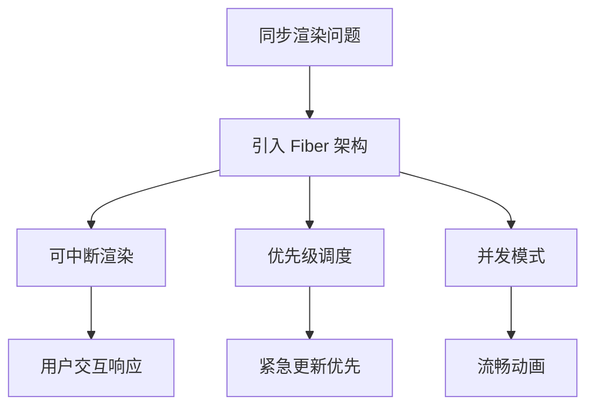

# React Fiber 架构与并发模式

React Fiber 是 React 16+ 引入的新架构，它彻底改变了 React 的渲染机制，为并发特性奠定了基础。本篇将深入剖析 Fiber 架构的设计原理、工作流程，以及 React 18 并发模式的实际应用。

## 为什么需要 Fiber

### 同步渲染的问题

在 React 15 及之前，React 使用递归的方式遍历虚拟 DOM 树，这个过程是同步的、不可中断的。

```tsx
// React 15 的同步渲染问题
function App() {
  const [count, setCount] = useState(0);
  const [items, setItems] = useState(generateLargeList());

  return (
    <div>
      <button onClick={() => setCount(count + 1)}>
        Count: {count}
      </button>
      {/* 渲染大量列表项时，点击按钮会卡顿 */}
      <ul>
        {items.map((item, index) => (
          <ListItem key={index} item={item} />
        ))}
      </ul>
    </div>
  );
}
```

| 问题 | 描述 | 影响 |
|------|------|------|
| 长任务阻塞 | 递归渲染不可中断 | 用户交互无响应 |
| 优先级缺失 | 所有更新同等对待 | 紧急更新被延迟 |
| 动画卡帧 | 主线程被占用 | 动画不流畅 |
| 输入延迟 | 无法及时响应 | 用户体验差 |

### Fiber 解决方案



## Fiber 节点结构

```tsx
// Fiber 节点结构（简化版）
interface FiberNode {
  // 节点类型
  tag: number;           // 组件类型（FunctionComponent、ClassComponent 等）
  type: any;            // 组件函数/类
  key: string | null;   // React key

  // 链表结构
  child: FiberNode | null;    // 第一个子节点
  sibling: FiberNode | null;  // 下一个兄弟节点
  return: FiberNode | null;   // 父节点

  // 状态
  pendingProps: any;     // 新 props
  memoizedProps: any;    // 上次渲染的 props
  memoizedState: any;    // 上次渲染的 state

  // 副作用
  flags: number;         // 副作用标记（Placement、Update、Deletion）
  updateQueue: any;      // 更新队列

  // 调度优先级
  lanes: number;         // 优先级车道
}
```

### Fiber 树遍历

```tsx
// Fiber 树结构示例
/*
         App (Fiber)
        / | \
       /  |  \
    Header Main Footer
        |
       Title

遍历顺序：App → Header → Title → Main → Footer
*/

// 深度优先遍历算法
function workInProgressTree(fiber: FiberNode | null) {
  if (!fiber) return;

  // 1. 处理当前节点
  beginWork(fiber);

  // 2. 处理子节点
  if (fiber.child) {
    workInProgressTree(fiber.child);
  }

  // 3. 处理兄弟节点
  if (fiber.sibling) {
    workInProgressTree(fiber.sibling);
  }

  // 4. 完成当前节点
  completeWork(fiber);
}
```

## 双缓冲（Double Buffering）机制

React 维护两棵 Fiber 树：

```tsx
/*
  Current Tree (屏幕显示)    Work-in-Progress Tree (内存中构建)
         ↓                              ↓
      App                           App'
     / | \                         / | \
    /  |  \                       /  |  \
 Header Main Footer          Header' Main' Footer'

渲染完成后，Work-in-Progress 成为新的 Current Tree
*/

// React 使用 current 指针切换树
let currentRoot: FiberNode | null = null;

function render(element: ReactElement) {
  const current = currentRoot;
  const workInProgress = createWorkInProgress(current, element);

  // 在 Work-in-Progress 树上工作
  workInProgressLoop(workInProgress);

  // 提交变更，切换指针
  commitRoot(workInProgress);
  currentRoot = workInProgress;
}
```

| 树 | 用途 | 特点 |
|----|------|------|
| Current Tree | 屏幕显示 | 稳定，只读 |
| Work-in-Progress Tree | 内存构建 | 可变，构建中 |

## 工作循环（Work Loop）

### Render 阶段

```tsx
// Render 阶段：构建 Work-in-Progress 树
// 可以中断，没有副作用

function workLoop(deadline: IdleDeadline) {
  let shouldYield = false;

  while (nextUnitOfWork && !shouldYield) {
    // 执行工作单元
    nextUnitOfWork = performUnitOfWork(nextUnitOfWork);

    // 检查是否需要让出主线程
    shouldYield = deadline.timeRemaining() < 1;
  }

  if (nextUnitOfWork) {
    // 还有工作，安排下一帧继续
    requestIdleCallback(workLoop);
  } else {
    // 工作完成，进入 Commit 阶段
    commitRoot();
  }
}

function performUnitOfWork(fiber: FiberNode): FiberNode | null {
  // 1. 开始工作
  beginWork(fiber);

  // 2. 返回下一个工作单元
  if (fiber.child) {
    return fiber.child;
  }

  // 3. 没有子节点，返回兄弟节点或父节点
  let nextFiber = fiber;
  while (nextFiber) {
    completeWork(nextFiber);

    if (nextFiber.sibling) {
      return nextFiber.sibling;
    }

    nextFiber = nextFiber.return;
  }

  return null;
}
```

### Commit 阶段

```tsx
// Commit 阶段：同步执行，有副作用
// 不可中断，确保 UI 一致性

function commitRoot() {
  // 1. Before Mutation 阶段
  commitBeforeMutationEffects(root);

  // 2. Mutation 阶段：执行 DOM 操作
  commitMutationEffects(root);

  // 3. Layout 阶段：执行副作用
  commitLayoutEffects(root);

  // 4. 切换 Current 树
  root.current = root.finishedWork;
}
```

| 阶段 | 可中断 | 有副作用 | 主要工作 |
|------|--------|----------|----------|
| Render | 是 | 否 | 构建 WIP 树 |
| Commit | 否 | 是 | DOM 操作、useEffect |

## 并发模式

### 可中断渲染

```tsx
// React 18 的并发特性允许渲染被中断
function App() {
  const [count, setCount] = useState(0);
  const [items, setItems] = useState([]);

  const handleClick = () => {
    // 这个更新可以被中断
    setCount(c => c + 1);
  };

  const handleLoad = async () => {
    // 这个更新优先级较低
    const data = await fetchData();
    setItems(data);
  };

  return (
    <div>
      <button onClick={handleClick}>Count: {count}</button>
      <button onClick={handleLoad}>Load Data</button>
      <List items={items} />
    </div>
  );
}
```

### 优先级调度

```tsx
/*
  优先级车道（Lanes）模型：

  Sync Lane (同步)          0b0000000000000000000000000000001
  Input Continuous Lane     0b0000000000000000000000000000100
  Default Lane (默认)       0b0000000000000000000000000010000
  Transition Lane (过渡)    0b0000000000000000000000001000000
  Idle Lane (空闲)          0b0100000000000000000000000000000
*/

// 不同更新类型使用不同优先级
function App() {
  const [text, setText] = useState('');
  const [deferredText, setDeferredText] = useState('');
  const [isPending, startTransition] = useTransition();

  const handleInput = (e) => {
    // 高优先级：立即更新输入框
    setText(e.target.value);

    // 低优先级：可中断的更新
    startTransition(() => {
      setDeferredText(e.target.value);
    });
  };

  return (
    <div>
      <input value={text} onChange={handleInput} />
      {isPending && <Spinner />}
      <ExpensiveList text={deferredText} />
    </div>
  );
}
```

## React 18 并发特性

### startTransition

```tsx
import { useState, useTransition } from 'react';

function SearchResults() {
  const [query, setQuery] = useState('');
  const [results, setResults] = useState([]);
  const [isPending, startTransition] = useTransition();

  const handleSearch = (e) => {
    const value = e.target.value;
    setQuery(value);  // 高优先级更新

    startTransition(() => {
      // 低优先级更新，可以被中断
      setResults(filterAndSortResults(value));
    });
  };

  return (
    <div>
      <input value={query} onChange={handleSearch} />
      {isPending && <div className="spinner">搜索中...</div>}
      <ResultList results={results} />
    </div>
  );
}
```

### useDeferredValue

```tsx
import { useState, useDeferredValue } from 'react';

function SearchInput() {
  const [text, setText] = useState('');
  const deferredText = useDeferredValue(text);

  return (
    <div>
      <input value={text} onChange={(e) => setText(e.target.value)} />
      {/* deferredText 延迟更新，避免频繁渲染 */}
      <ExpensiveList filter={deferredText} />
    </div>
  );
}

// 自定义 hook：显示延迟状态
function useDeferredStatus(value: string) {
  const deferredValue = useDeferredValue(value);
  const isStale = value !== deferredValue;

  return { deferredValue, isStale };
}

function SearchWithStatus() {
  const [text, setText] = useState('');
  const { deferredValue, isStale } = useDeferredStatus(text);

  return (
    <div>
      <input value={text} onChange={(e) => setText(e.target.value)} />
      {isStale && <span className="badge">更新中...</span>}
      <ExpensiveList filter={deferredValue} />
    </div>
  );
}
```

### Suspense 增强

```tsx
import { Suspense, lazy } from 'react';

// 代码分割
const LazyComponent = lazy(() => import('./HeavyComponent'));

function App() {
  return (
    <div>
      <h1>My App</h1>

      <Suspense fallback={<div>Loading...</div>}>
        <LazyComponent />
      </Suspense>

      {/* 嵌套 Suspense */}
      <Suspense fallback={<Skeleton />}>
        <Suspense fallback={<Spinner />}>
          <AsyncComponent />
        </Suspense>
      </Suspense>
    </div>
  );
}

// 使用 Suspense 获取数据
function UserProfile({ userId }) {
  return (
    <Suspense fallback={<UserProfileSkeleton />}>
      <UserProfileData userId={userId} />
    </Suspense>
  );
}

// 配合 React Cache 使用
import { cache } from 'react';

const getUser = cache(async (id) => {
  const response = await fetch(`/api/users/${id}`);
  return response.json();
});

async function UserProfileData({ userId }) {
  const user = await getUser(userId);

  return (
    <div>
      <h2>{user.name}</h2>
      <p>{user.email}</p>
    </div>
  );
}
```

## 并发特性实际应用场景

### 搜索框防抖

```tsx
import { useState, useTransition, useDeferredValue, useMemo } from 'react';

// 方案一：使用 useTransition
function SearchWithTransition() {
  const [query, setQuery] = useState('');
  const [results, setResults] = useState([]);
  const [isPending, startTransition] = useTransition();

  const handleSearch = (value) => {
    setQuery(value);

    startTransition(() => {
      // 模拟耗时搜索
      const filtered = expensiveFilter(value);
      setResults(filtered);
    });
  };

  return (
    <div>
      <input value={query} onChange={(e) => handleSearch(e.target.value)} />
      {isPending && <Spinner />}
      <ResultList results={results} />
    </div>
  );
}

// 方案二：使用 useDeferredValue
function SearchWithDeferredValue() {
  const [text, setText] = useState('');
  const deferredText = useDeferredValue(text);
  const isStale = text !== deferredText;

  const results = useMemo(
    () => expensiveFilter(deferredText),
    [deferredText]
  );

  return (
    <div>
      <input value={text} onChange={(e) => setText(e.target.value)} />
      {isStale && <Spinner />}
      <ResultList results={results} />
    </div>
  );
}

// 方案三：手动防抖 + 并发特性
function SearchWithDebounce() {
  const [text, setText] = useState('');
  const [debouncedText, setDebouncedText] = useState('');
  const [isPending, startTransition] = useTransition();

  useEffect(() => {
    const timer = setTimeout(() => {
      setDebouncedText(text);
    }, 300);

    return () => clearTimeout(timer);
  }, [text]);

  const results = useMemo(
    () => expensiveFilter(debouncedText),
    [debouncedText]
  );

  return (
    <div>
      <input value={text} onChange={(e) => setText(e.target.value)} />
      {text !== debouncedText && <Spinner />}
      <ResultList results={results} />
    </div>
  );
}
```

### 复杂列表渲染

```tsx
import { useState, useTransition, memo } from 'react';

// 虚拟列表组件
function VirtualList({ items }: { items: Item[] }) {
  const [visibleRange, setVisibleRange] = useState({ start: 0, end: 50 });
  const [isPending, startTransition] = useTransition();

  const handleScroll = (e) => {
    const { scrollTop, clientHeight } = e.target;
    const start = Math.floor(scrollTop / ITEM_HEIGHT);
    const end = Math.ceil((scrollTop + clientHeight) / ITEM_HEIGHT);

    startTransition(() => {
      setVisibleRange({ start, end });
    });
  };

  const visibleItems = items.slice(visibleRange.start, visibleRange.end);

  return (
    <div
      style={{ height: '600px', overflow: 'auto' }}
      onScroll={handleScroll}
    >
      <div style={{ height: items.length * ITEM_HEIGHT, position: 'relative' }}>
        {visibleItems.map((item, index) => (
          <ListItem
            key={item.id}
            item={item}
            style={{
              position: 'absolute',
              top: (visibleRange.start + index) * ITEM_HEIGHT,
            }}
          />
        ))}
      </div>
      {isPending && <LoadingOverlay />}
    </div>
  );
}

// 使用 memo 优化列表项
const ListItem = memo(function ListItem({
  item,
  style,
}: {
  item: Item;
  style: React.CSSProperties;
}) {
  return (
    <div style={style} className="list-item">
      {item.name}
    </div>
  );
});
```

## React Server Components 简介

```tsx
// Server Components 在服务端执行
// app/components/UserList.tsx
import { db } from '@/lib/database';

export default async function UserList() {
  // 直接访问数据库（在服务端）
  const users = await db.user.findMany();

  // 不能使用 hooks 和浏览器 API
  return (
    <ul>
      {users.map(user => (
        <li key={user.id}>{user.name}</li>
      ))}
    </ul>
  );
}

// Client Components 在客户端执行
// app/components/AddUser.tsx
'use client';

import { useState } from 'react';

export default function AddUser() {
  const [name, setName] = useState('');

  const handleSubmit = async (e) => {
    e.preventDefault();
    await fetch('/api/users', {
      method: 'POST',
      body: JSON.stringify({ name }),
    });
  };

  return (
    <form onSubmit={handleSubmit}>
      <input value={name} onChange={(e) => setName(e.target.value)} />
      <button type="submit">添加用户</button>
    </form>
  );
}
```

## 性能对比

| 特性 | React 15 (同步) | React 18 (并发) |
|------|----------------|-----------------|
| 渲染中断 | 不支持 | 支持 |
| 优先级调度 | 无 | Lanes 模型 |
| 输入响应 | 可能延迟 | 优先响应 |
| 动画流畅度 | 可能卡顿 | 平滑 |
| 数据加载 | 阻塞渲染 | 可中断 |
| 内存使用 | 较高 | 优化 |

## 最佳实践总结

1. **优先使用 Server Components** - 减少客户端 JS 体积
2. **合理使用 startTransition** - 将非紧急更新标记为可中断
3. **使用 useDeferredValue** - 延迟非关键更新
4. **配合 Suspense 使用** - 优雅处理加载状态
5. **避免在 Server Components 中使用 hooks** - 它们只在客户端执行
6. **使用 memo 优化列表项** - 减少不必要的重渲染
7. **监控性能** - 使用 React DevTools Profiler
8. **渐进式迁移** - 逐步采用并发特性
9. **测试并发行为** - 确保在不同网络条件下正常工作
10. **了解限制** - 并发特性不适用于所有场景

React Fiber 架构和并发模式是 React 的重大演进，理解它们将帮助你构建更流畅、响应更快的用户界面。
